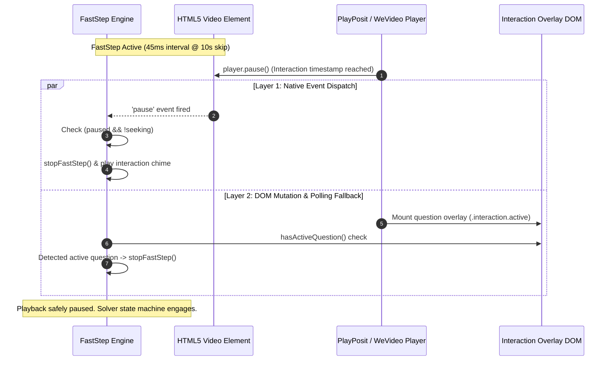
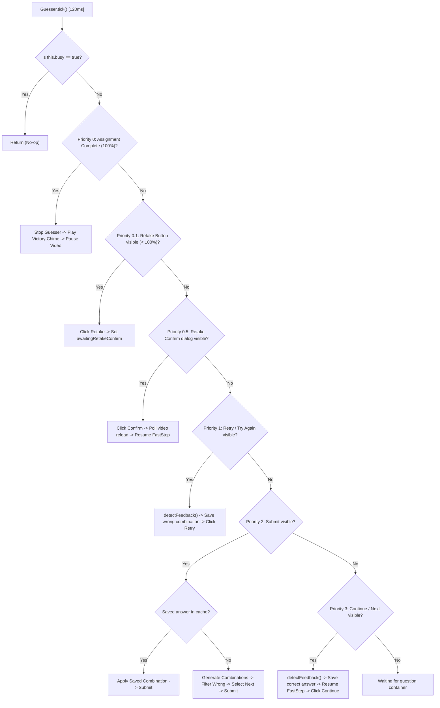

# WeVideo (Playposit) ToolKit — Technical Architecture & Interaction Specification

This document provides a technical specification and architecture reference for **WeVideo (Playposit) ToolKit**, a Manifest V3 browser extension engineered for playback acceleration and automated question resolution across interactive video platforms (specifically **PlayPosit** and **WeVideo Interactivity**).

---

## 1. System Overview & Injection Architecture

```mermaid
flowchart TD
    subgraph HostWindow ["Host Window (LMS / Canvas / Top Frame)"]
        TopFrame["Top Window (Canvas / Blackboard / LMS)"]
        HostPanel["Unified Control Panel (Mounted below player)"]
        HostScript["content.js (Host Role)"]
    end

    subgraph MV3Context ["Extension Background Context"]
        ServiceWorker["Background Service Worker (background.js)"]
        Manifest["Extension Manifest (manifest.json)"]
    end

    subgraph IframeContext ["Player Frame (iframe)"]
        PlayerScript["content.js (Player Role)"]
        FastStep["FastStep Engine (Legacy / Balanced / Super)"]
        Guesser["Guesser State Machine (Priority 0–3)"]
        VideoElement["HTML5 Video Element (<video>)"]
        PlayerUI["PlayPosit / WeVideo DOM & Vuetify UI"]
    end

    subgraph MainWorldContext ["Main Execution Context"]
        InjectScript["Visibility & Focus Spoofer (inject.js)"]
    end

    Manifest -->|Registers service worker & host permissions| ServiceWorker
    ServiceWorker -.->|Dynamic script injection| HostScript
    ServiceWorker -.->|Dynamic script injection| PlayerScript
    HostScript <-->|postMessage bus (solve-sync, faststep-state, time-update)| PlayerScript
    PlayerScript -->|DOM Injection| InjectScript
    PlayerScript -->|Controls & Monitors| VideoElement
    PlayerScript -->|Inspects & Interacts| PlayerUI
```

### 1.1 Multi-World Injection Strategy
The extension operates across two distinct JavaScript execution contexts:
1. **Isolated World (`content.js`)**: Executes the primary FastStep control loop, DOM mutation observers, unified host panel rendering, and the combinatorial solver state machine.
2. **Main World (`inject.js`)**: Injected directly into the document via `<script>` element injection to override prototypes and document properties inaccessible or un-spoofable from an isolated world.

### 1.2 Cross-Origin Iframe Communication Bus
Interactive bulbs are typically embedded in cross-origin iframes (e.g., `https://api.playposit.com` or `https://interactivity.wevideo.com`). 
Communication between the host LMS window and player subframes operates via a structured `window.postMessage` bus:
- **`solve-start` / `solve-stop` / `solve-sync`**: Dispatched from the host panel to child frames to synchronize AutoSolve states.
- **`faststep-toggle` / `faststep-stop`**: Routes user acceleration commands to the active `<video>` player frame.
- **`time-update`**: Emitted by the player frame every 300ms to update the host panel's timeline display.
- **`status` / `player-ready`**: Relays operational messages and ready states up to the host UI.

### 1.3 Visibility & Blur Neutralization (`inject.js`)
PlayPosit incorporates defensive event listeners (`visibilitychange`, `blur`, `focusout`, `pagehide`) and document property checks to pause video playback when the user navigates away from the browser tab. `inject.js` neutralizes these checks:
- Overwrites `document.hidden` and `document.webkitHidden` getters to return `false`.
- Overwrites `document.visibilityState` to return `'visible'`.
- Registers capturing-phase (`useCapture = true`) event listeners that execute `event.stopImmediatePropagation()` to discard tab unfocus events before player code receives them.

---

## 2. Pause & Video Interruption Detection

Detecting question milestones is critical for playback acceleration. When a question timestamp is reached on the timeline, the platform issues `player.pause()` and displays the question overlay. The toolkit implements a **dual-layer, zero-latency detection architecture**.



### 2.1 Pacing Modes & Stream Buffering
- **Legacy Mode:** 5-second skip intervals every 90ms. Maximizes stability on slower network connections or high-bitrate video streams.
- **Balanced Mode (Recommended):** 10-second skip intervals every 45ms with hardware-accelerated timeline synchronization. Fast progression while protecting stream buffer integrity.
- **Super Mode (Experimental):** Direct timeline advancement toward the video finish. PlayPosit's internal listeners catch the seek and stop at the upcoming interaction milestone.

### 2.2 Autoplay Prevention & User Control
- Videos do not autoplay on tab load or manual browser refresh (F5).
- If the user pauses playback via player controls, the extension halts FastStep immediately and preserves the paused state without attempting buffering retries.

---

## 3. Automated Solver Engine ("Guesser")

The Guesser is an autonomous state machine that runs on a 120ms polling loop (`tick()`). It implements a priority hierarchy to handle assignment retakes, answer submissions, error feedback, and progression.



### 3.1 State Hierarchy (Priority Chain)

| Priority | Trigger Element | Action Performed |
| :--- | :--- | :--- |
| **0.0** | Score displays 100% / Complete | Halts solver, plays victory chime, pauses playback. |
| **0.1** | `Retake`, `Retake Bulb`, `Reset` | If score < 100%, clicks retake to reset the assignment for another run. |
| **0.5** | `Confirm`, `Yes, retake`, `Start` | Confirms retake modal dialog, polls player re-hydration, and resumes FastStep. |
| **1.0** | `Retry`, `Try Again` | Extracts feedback from failed trial, logs combination as known-wrong, extracts revealed correct answers, clicks Retry. |
| **2.0** | `Submit` | Applies cached correct answer if present; otherwise tests candidate combinations and clicks Submit. |
| **3.0** | `Continue`, `Next` | Evaluates final question feedback, records correct answers to `localStorage`, resumes FastStep, clicks Continue. |

### 3.2 Combinatorial Search Algorithm
For unencountered questions where the platform does not reveal answers:
- **Single Choice (Radio):** Tests candidate options systematically.
- **Multiple Choice (Checkboxes / "Select All"):** Generates the power set ($2^N - 1$), prioritizing smaller combination sizes first, and filters out known incorrect combinations so mistakes are never repeated.

---

## 4. Visual Feedback & Answer Learning

When a question attempt fails, PlayPosit/WeVideo renders feedback classes indicating which options were correct, incorrect, or missed. The toolkit parses this DOM state to short-circuit trial sequences:

| Indicator / Selector | DOM Meaning | Solver Action |
| :--- | :--- | :--- |
| `.missed`, text `"Missed"` | A correct checkbox that was not selected. | Added to the correct answer set. |
| `.correct`, `.success`, `.is-correct` | A correct option that was selected. | Added to the correct answer set. |
| Checkmark icon (`check`, `check_circle`) | Correct option confirmation. | Added to the correct answer set. |
| `.incorrect`, `.error`, text `"Incorrect"` | An erroneous selection. | Disqualified from candidate sets. |

### 4.1 False-Positive Elimination
In single-choice radio questions, Vuetify highlights active radio buttons using the platform theme color. The solver utilizes a negative disqualifier: if an option container contains `.incorrect` or red error styling, it is rejected regardless of active radio selection styles.

---

## 5. Source File Manifest

| File | Context | Purpose & Responsibilities |
| :--- | :--- | :--- |
| [`manifest.json`](manifest.json) | Manifest V3 | Declares extension metadata, permissions (`activeTab`, `scripting`, `webNavigation`, `storage`), and web-accessible resources. |
| [`background.js`](background.js) | Service Worker | Manages active tab state, handles auto-initialization URL matching, and injects scripts on subframe retakes. |
| [`content.js`](content.js) | Isolated World | Primary engine containing host panel rendering, iframe communication, FastStep acceleration, and the Guesser solving machine. |
| [`inject.js`](inject.js) | Main World | Overrides native document visibility getters and intercepts focus/blur events. |
| [`styles.css`](styles.css) | Isolated World | Native PlayPosit styling with 4px border radii. |
| [`onboarding.html`](onboarding.html) | Options Page | Interactive user guide and configuration documentation. |
| [`onboarding.css`](onboarding.css) | Options Styling | Design sheet for the user guide. |
| [`README.md`](README.md) | Documentation | Public-facing documentation, installation guide, and usage instructions. |
| [`LICENSE`](LICENSE) | Licensing | MIT License terms. |
